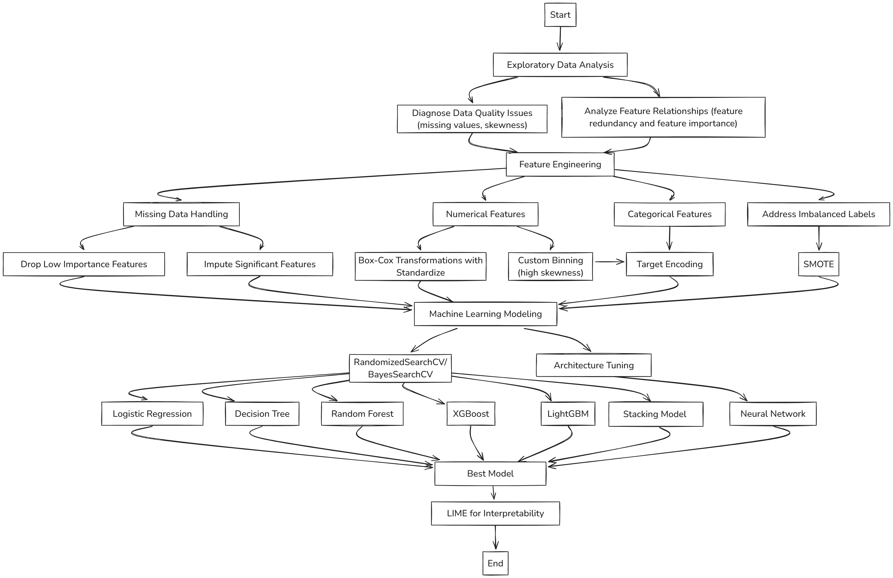
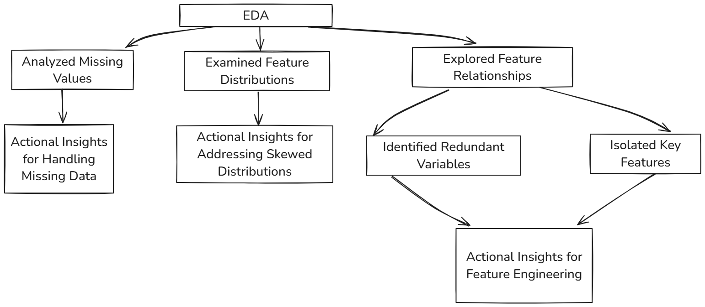
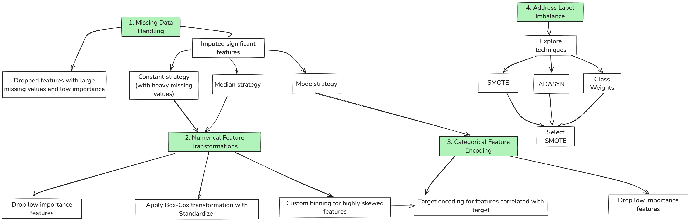
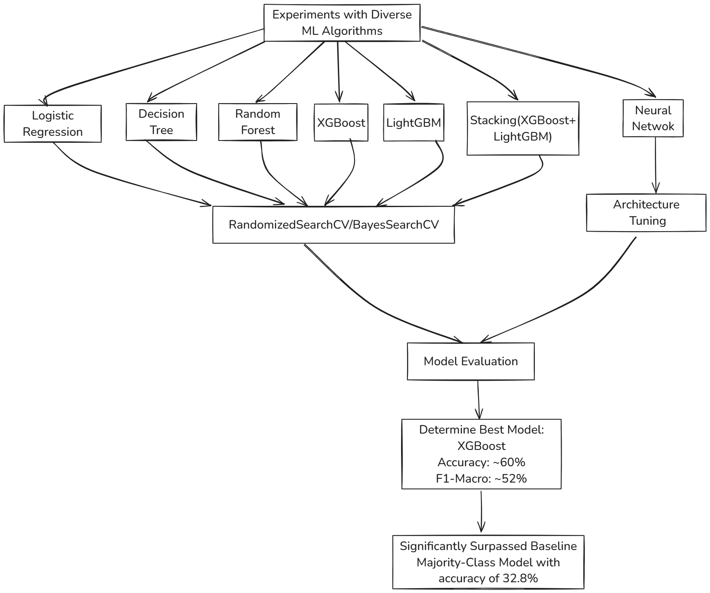

# Prudential-Life-Insurance-Assessment

## Overview
This project is based on a Kaggle competition from 2015, where Prudential Life Insurance sought to streamline its risk assessment process. Traditionally, applicants provided extensive information for risk classification, which was labor-intensive and time-consuming. The goal of this competition was to automate this process using predictive modeling, enabling quicker decision-making with reduced manual intervention.
- Dataset: Contains 126 attributes describing 59,381 applicants, including demographic, medical, and insurance-related features.
- Objective: Predict the ordinal "Response" variable (8 levels) for each applicant, representing their risk classification.
- Challenges:
  - A large number of features requiring extensive feature engineering for feature selection.
  - An ordinal 8-class classification task requiring specialized modeling approaches.

## Methodology

## Key Highlights
1. Comprehensive Exploratory Data Analysis (EDA):
   

2. Advanced Feature Engineering:

3. Robust Machine Learning Modeling:

## Results
### Modeling Performance

| Model                 | Accuracy (No Data Prep) | F1-Macro (No Data Prep) | Accuracy (With Data Prep) | F1-Macro (With Data Prep) |
|-----------------------|--------------------|--------------------|-----------------------|-----------------------|
| XGBoost               | 58.8%             | 51.7%             | 58.6%                | 52.3%                |
| LightGBM              | 58.6%             | 50.8%             | -                    | -                    |
| Stacked Model         | 58.9%             | 51.8%             | -                    | -                    |
| Random Forest         | -                 | -                 | 57%                  | 49.8%                |
| Logistic Regression   | -                 | -                 | 48.1%                | 43.1%                |
| Decision Tree         | -                 | -                 | 47.2%                | 40.9%                |
| Neural Network        | -                 | -                 | 52%                  | 45%                  |

### Best Model: 
XGBoost achieved an accuracy of ~60% and an F1-macro score of ~52%, significantly surpassing the baseline majority-class model (accuracy ~33%).

## Conclusion
This project demonstrates the importance of comprehensive EDA and advanced feature engineering in tackling complex machine learning problems. By addressing data quality issues, leveraging advanced preprocessing techniques, and experimenting with robust models, I significantly improved performance metrics for an ordinal classification task.

These methodologies are not only effective in the insurance domain but also transferable to other industries requiring predictive modeling on structured datasets.

